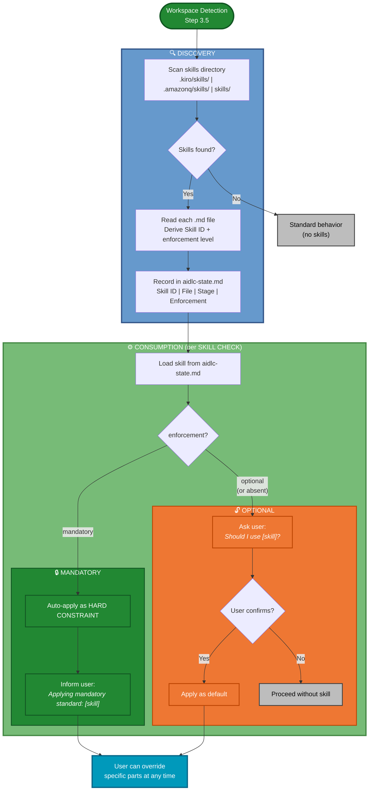

# Organizational Skills

**Purpose**: Enable the AI-DLC framework to discover and leverage pre-existing organizational skill files (templates, standards, conventions) when present in the workspace, without requiring them.

## What Are Organizational Skills?

An **Organizational Skill** is a Markdown file (`.md`) that contains pre-established templates, standards, or conventions that an organization uses across projects. Skills are **external** to the AI-DLC framework — they are maintained independently and optionally made available in the project workspace.

Skills are **ADDITIVE**: they complement the AI-DLC workflow but never replace it. Every stage continues to function normally whether skills are present or not.

## How Skills Are Discovered

During **Workspace Detection** (Step 3.5), the agent scans for a skills directory in the workspace:

**Candidate locations** (checked in order, first match wins):
1. `.kiro/skills/`
2. `.amazonq/skills/`
3. `skills/`

**Discovery rules**:
- If a skills directory is found → scan all `.md` files (including subdirectories)
- Each `.md` file is treated as one skill
- Skills are registered by their **Skill ID** (derived from directory name or filename without extension)
- If no skills directory is found → skip silently, workflow continues normally

## Built-in Skill IDs

The framework recognizes certain **Skill IDs** and automatically maps them to the stages that consume them. This mapping is convention-based — the skill file can contain any content as long as it uses a recognized ID.

| Skill ID | Consumed By Stage | Purpose |
|----------|-------------------|---------|
| `hu-format` or `hu-template` | User Stories (Step 16) | Custom User Story template — format, fields, numbering |
| `db-standards` or `database` | Code Generation (Step 1) | Database naming conventions, access patterns, SP templates |
| `database-audit` | Code Generation (Step 1) | Audit columns, soft delete, logging tables, error capture |
| `database-modeling` | Code Generation (Step 1) | Data modeling: table design, constraints, indexes, transactions |
| `database-security` | Code Generation (Step 1) | SQL injection prevention, error codes, input validations |
| `api-standards` | API Contract Design | API conventions, endpoint naming, response format |
| `code-standards` | Code Generation (Step 1) | Code architecture patterns, folder structure, naming |
| `test-standards` | Build and Test | Testing conventions, coverage requirements, naming |
| `security-baseline` | ISO 27001 Assessment | Pre-established security controls and baselines |
| `repo-structure` | Requirements Analysis (Step 5b) | Repository codification convention and project type inference |

**Custom Skill IDs**: Any `.md` file found in the skills directory is loaded regardless of its ID. Custom skills are available for the agent to reference when relevant, even if they don't match a built-in ID.

## Skill Enforcement Levels

Skills can declare an **enforcement level** via the `enforcement` field in their YAML frontmatter:

| Level | Frontmatter | Behavior |
|-------|-------------|----------|
| **mandatory** | `enforcement: mandatory` | Auto-applied as HARD CONSTRAINT. Agent informs the user what standards are being applied but does NOT ask for confirmation. User can still override specific parts if explicitly requested. |
| **optional** | `enforcement: optional` (or field absent) | Agent presents the skill and asks the user for confirmation before applying. This is the default behavior. |

**Example frontmatter** (mandatory):
```yaml
---
name: database-audit
metadata:
  enforcement: mandatory
---
```

**Example frontmatter** (optional — same as omitting the field):
```yaml
---
name: ui-conventions
metadata:
  enforcement: optional
---
```

**Why this distinction matters**: Some skills define fixed organizational standards (audit columns, naming conventions, security rules) that are non-negotiable. Asking the user to "confirm" every time adds friction without value — the answer is always yes. Mandatory enforcement eliminates that friction while preserving transparency.

## Skills Flow



**Legend:**
- 🟢 Green = mandatory path (auto-applied, no confirmation)
- 🟠 Orange = optional path (user confirms)
- 🔵 Cyan = user override (available on both paths)
- ⬜ Gray = no skill / skipped

## How Skills Are Consumed

Each consuming stage includes a **SKILL CHECK** block that follows this pattern:

```
### SKILL CHECK: [Skill ID]
IF `aidlc-state.md` → Organizational Skills section lists a skill matching [Skill ID]:
  1. Load the skill file content
  2. Read the `enforcement` field from the skill's YAML frontmatter
  3. IF enforcement = "mandatory":
     → Auto-apply the skill as a HARD CONSTRAINT
     → Inform the user (do NOT ask for confirmation):
       > "Applying mandatory organizational standard: [skill name] — [brief description].
       > These rules are fixed. You can override specific parts if needed."
  4. IF enforcement = "optional" OR field is absent:
     → Present the skill to the user for confirmation:
       > "I found an organizational skill for [purpose]: [skill name].
       > Should I use this as the base template/standard? You can also override specific parts."
     → IF user confirms → Apply skill content as the default
     → IF user declines → Proceed with standard AI-DLC behavior (ask from scratch)
ELSE:
  Continue with standard behavior (no skill available)
```

### Precedence Rules

1. **User runtime declarations override skill content** — even mandatory skills. If the user explicitly provides instructions that conflict with a loaded skill, the user's input takes precedence.
2. **Organizational Standards (Step 5) override skills**. If the user declares technology standards during Requirements Analysis, those HARD CONSTRAINTS supersede any contradicting skill content.
3. **Mandatory skills are auto-applied, not auto-confirmed**. The user is always informed what is being applied and can override specific parts — but they don't need to say "yes" every time.
4. **Optional skills provide defaults, not mandates**. They reduce the number of questions the agent needs to ask, but never silently override user decisions.

## State Tracking

When skills are discovered, they are recorded in `aidlc-docs/aidlc-state.md` under a dedicated section:

```markdown
## Organizational Skills
- **Skills Directory**: [path where skills were found]
- **Skills Loaded**:

| Skill ID | File | Matched Stage | Enforcement |
|----------|------|---------------|-------------|
| hu-template | skills/hu-template/SKILL.md | User Stories | mandatory |
| database | skills/database/SKILL.md | Code Generation | mandatory |
| [custom-id] | skills/custom-id/SKILL.md | (general reference) | optional |
```

## Examples

### Example 1: Mandatory Skill — Database Audit

During Code Generation (Step 1), the agent finds `database-audit` (enforcement: mandatory):

1. Agent loads the skill content (audit columns, RecordStatus, soft delete, Log schema, GetErrorInfo)
2. Agent informs: *"Applying mandatory organizational standard: `database-audit` — audit columns, soft delete via RecordStatus, Log schema, GetErrorInfo in CATCH blocks."*
3. **No confirmation needed** — rules are applied directly as HARD CONSTRAINTS
4. Generated code includes all 5 audit columns, CHECK constraint, and GetErrorInfo calls automatically
5. User can still override specific parts if explicitly requested

### Example 2: Optional Skill — Custom UI Conventions

During Code Generation, the agent finds a custom `ui-conventions` skill (enforcement: optional or absent):

1. Agent loads the skill content (e.g., component naming, folder structure, theme tokens)
2. Agent asks: *"Found an organizational skill for UI conventions: `ui-conventions`. It defines component naming and folder structure. Should I use this as the base standard?"*
3. User confirms → Generated code follows the conventions
4. User declines → Agent proceeds with standard behavior
5. User can override specific conventions if needed

### Example 3: No Skills Found

During Workspace Detection, no skills directory is detected:

1. Agent logs: "No organizational skills directory found"
2. Workflow continues normally — all stages ask their standard questions
3. No impact on any downstream behavior

## Skill Feedback

During Construction, skill performance is tracked to help skills mature iteratively. Feedback is captured at three points: Code Generation (early detection of deviations and gaps), Code Review (validation of accepted patterns), and Build & Test (runtime verification). Each entry records whether skill-generated patterns were correct (`ok`), needed adjustment (`correction`), or were missing guidance (`gap`), along with the skill version for traceability. At Closure, feedback is aggregated into a Skill Health Report.

For full details on the feedback system — result types, severity levels, file format, and capture rules — see **`common/skill-feedback.md`**.

## Key Principles

- **Agnostic**: The skills system works with any IDE, agent platform, or project structure
- **Optional**: Skills are never required — the framework works identically without them
- **Transparent**: Every skill application is communicated to the user — mandatory skills inform, optional skills ask
- **Non-invasive**: Skills live outside the framework and are discovered, not configured
- **Additive only**: Skills provide standards and reduce questions — they never skip stages or bypass gates
- **User override**: Even mandatory skills can be overridden if the user explicitly requests it
- **Feedback-driven**: Skill performance is captured during Construction and aggregated at Closure for iterative improvement
