# Plan de Ejecución — Ñami (ALIM-MOB)

**Versión**: 1.0  
**Fecha**: 2026-07-11  
**Estado**: Pendiente de aprobación

---

## 1. Resumen del Análisis de Alcance

### 1.1 Contexto de la solicitud

| Atributo | Valor |
|----------|-------|
| Tipo de solicitud | New Project |
| Alcance | Large — 8 HUs, 15 pantallas, 6 tablas BD, 5 capas (DB, Models, Repositories, Services, UI) |
| Complejidad | Moderate — lógica local completa, sin APIs externas, sin autenticación |
| Nivel de riesgo | **Bajo** — app personal monousuario, sin datos sensibles, sin infraestructura cloud |
| Arquitectura | Single-Repo / Monolith Mobile (Flutter) |
| Multi-Repo | No — todas las capas en el mismo proyecto Flutter |

### 1.2 Evaluación de impacto por área

| Área | Aplica | Descripción |
|------|--------|-------------|
| Cambios al usuario | ✅ Sí | App completa nueva — todas las pantallas son nuevas |
| Cambios estructurales | ✅ Sí | Scaffolding actual se reemplaza completamente |
| Cambios al modelo de datos | ✅ Sí | 6 tablas SQLite nuevas desde cero |
| Cambios de API | ❌ No | No hay API externa |
| Impacto NFRs | ✅ Sí | Performance local (SQLite), responsive tablet, i18n preparado |
| Infraestructura | ❌ No | Sin infraestructura cloud ni servidores |
| Operaciones | ❌ No | App distribuida vía stores — sin CI/CD complejo |

### 1.3 Evaluación de riesgo

**Nivel: BAJO**

- Scope 100% en dispositivo — ningún sistema externo afectado
- Sin autenticación ni datos sensibles de usuarios
- Stack consolidado (Flutter + sqflite + Riverpod) — bien documentado
- Rollback trivial: es un proyecto personal, no hay producción crítica
- El riesgo más alto es la lógica del algoritmo de lista de compras (agrupación + segmentación)

---

## 2. Perfil de Stages (New Project × Large)

Basado en la matriz **New Project × Any Scope** del workflow:

| Stage | Recomendación | Decisión | Razón |
|-------|--------------|----------|-------|
| User Stories | EXECUTE | **SKIP** | Ya existen en `mobile-user-stories.md` — completamente escritas y aceptadas |
| Prototyping | IF frontend | **SKIP** | App personal — no requiere aprobación de stakeholders con prototipos |
| ISO 27001 | Comprehensive | **Minimal** | App personal, sin PII, sin autenticación, sin datos sensibles |
| Spike/POC | IF uncertainty | **SKIP** | Stack conocido (Flutter+sqflite+Riverpod) — sin incertidumbre técnica |
| API Contract Design | EXECUTE | **SKIP** | No hay API externa — solo BD local. No aplica |
| ADR | EXECUTE | **EXECUTE** | Decisiones de stack (sqflite vs drift, Riverpod vs BLoC) merecen documentación |
| Application Design | EXECUTE | **EXECUTE** | Arquitectura de capas, patrón Repository, estructura de providers |
| QA Matrix | Comprehensive | **Standard** | App personal — tests de las reglas de negocio y flujos principales |
| Units Generation | EXECUTE | **EXECUTE** | 8 HUs → descomposición clara en unidades de trabajo |
| Definition of Ready | ALWAYS | **EXECUTE** | Gate obligatorio |
| Dependency Review | IF new deps | **EXECUTE** | Varias dependencias nuevas (sqflite, Riverpod, pdf, printing, etc.) |
| HU Guide Generation | IF multi-repo | **SKIP** | Single-Repo — no aplica |
| Functional Design | IF new logic | **EXECUTE** | Modelos, repos, lógica de lista de compras requieren diseño previo |
| NFR Requirements | IF perf/sec | **EXECUTE** | Performance SQLite, responsive tablet, i18n |
| NFR Design | IF NFR Req exec | **EXECUTE** | Patrones de diseño responsive + arquitectura i18n |
| Infrastructure Design | IF infra changes | **SKIP** | Sin infraestructura — app standalone |
| Code Generation | ALWAYS | **EXECUTE** | Core de la construcción |
| Code Review | ALWAYS | **EXECUTE** | Siempre |
| Build and Test | ALWAYS | **EXECUTE** | Siempre |
| Release Documentation | IF release | **EXECUTE** | Instrucciones de build + distribución (Android APK / iOS) |
| Project Snapshot | ALWAYS | **EXECUTE** | Cierre formal |
| Version & Archive | ALWAYS | **EXECUTE** | Siempre |
| Stakeholder Sign-off | IF formal | **SKIP** | Proyecto personal — sin stakeholders formales |
| Project Handoff | IF handoff | **SKIP** | Proyecto personal — sin transferencia de equipo |

---

## 3. Visualización del Workflow

```mermaid
flowchart TD
    Start([🚀 INICIO]):::purple

    subgraph INCEPTION["🔵 INCEPTION"]
        WD[Workspace Detection\nCOMPLETED]:::done
        RA[Requirements Analysis\nCOMPLETED]:::done
        US[User Stories\nSKIP]:::skip
        PROTO[Prototyping\nSKIP]:::skip
        ISO[ISO 27001\nEJECUTAR · Minimal]:::execute
        ADR[Architecture Decision Records\nEJECUTAR]:::execute
        WP[Workflow Planning\nEJECUTAR]:::done
        AD[Application Design\nEJECUTAR]:::execute
        QA[QA Matrix Generation\nEJECUTAR · Standard]:::execute
        UG[Units Generation\nEJECUTAR]:::execute
        DOR[Definition of Ready\nEJECUTAR]:::execute
    end

    subgraph CONSTRUCTION["🟢 CONSTRUCTION"]
        DR[Dependency Review\nEJECUTAR]:::execute
        FD[Functional Design\nEJECUTAR]:::execute
        NFR_R[NFR Requirements\nEJECUTAR]:::execute
        NFR_D[NFR Design\nEJECUTAR]:::execute
        CG[Code Generation\nEJECUTAR]:::always
        CR[Code Review\nEJECUTAR]:::always
        BAT[Build and Test\nEJECUTAR]:::always
    end

    subgraph OPERATIONS["🟡 OPERATIONS"]
        RD[Release Documentation\nEJECUTAR]:::execute
    end

    subgraph CLOSURE["🟣 CLOSURE"]
        PS[Project Snapshot\nEJECUTAR]:::always
        VA[Version y Archive\nEJECUTAR]:::always
    end

    Start --> WD --> RA --> US --> PROTO --> ISO --> ADR --> WP --> AD --> QA --> UG --> DOR
    DOR --> DR --> FD --> NFR_R --> NFR_D --> CG --> CR --> BAT
    BAT --> RD --> PS --> VA

    classDef done fill:#4CAF50,stroke:#1B5E20,stroke-width:3px,color:#fff
    classDef always fill:#4CAF50,stroke:#1B5E20,stroke-width:3px,color:#fff
    classDef execute fill:#FFA726,stroke:#E65100,stroke-width:3px,stroke-dasharray:5 5,color:#000
    classDef skip fill:#BDBDBD,stroke:#424242,stroke-width:2px,stroke-dasharray:5 5,color:#000
    classDef purple fill:#CE93D8,stroke:#6A1B9A,stroke-width:3px,color:#000

    linkStyle default stroke:#333,stroke-width:2px
```



**Alternativa en texto** (para entornos sin render Mermaid):

```
INCEPTION:  ✅WD → ✅RA → ⏭️US → ⏭️PROTO → 🔶ISO → 🔶ADR → ✅WP → 🔶AD → 🔶QA → 🔶UG → 🔶DOR
CONSTRUCTION:               🔶DR → 🔶FD → 🔶NFR-R → 🔶NFR-D → 🟩CG → 🟩CR → 🟩BAT
OPERATIONS:                                                                      🔶RD
CLOSURE:                                                                              🟩PS → 🟩VA

✅ COMPLETED  🔶 EXECUTE  ⏭️ SKIP  🟩 ALWAYS
```

---

## 4. Fases y Stages con Checkboxes

### 🔵 INCEPTION

- [x] **Workspace Detection** — COMPLETED
- [x] **Requirements Analysis** — COMPLETED
- [ ] **User Stories** — SKIP · *Ya existen en mobile-user-stories.md, completas y aceptadas*
- [ ] **Prototyping** — SKIP · *App personal, no requiere aprobación de stakeholders*
- [ ] ISO 27001 Assessment (Minimal) — EXECUTE · COMPLETED
- [ ] **Architecture Decision Records** — EXECUTE · COMPLETED · ADR-001 Flutter, ADR-002 sqflite, ADR-003 Riverpod, ADR-004 Repository+Service
- [x] **Workflow Planning** — EXECUTE (en curso)
- [ ] **Application Design** — EXECUTE · COMPLETED
- [ ] **QA Matrix Generation** — EXECUTE · COMPLETED · 68 casos (45 Unit, 17 Widget, 6 Integration) + 3 E2E flows
- [ ] **Units Generation** — EXECUTE · COMPLETED · 8 unidades, 3 sprints, story map completo
- [ ] **Definition of Ready** — EXECUTE · *Gate obligatorio*

### 🟢 CONSTRUCTION

- [ ] **Dependency Review** — EXECUTE · *8+ dependencias nuevas: sqflite, Riverpod, pdf, printing, etc.*
- [ ] **HU Guide Generation** — SKIP · *Single-Repo*
- [ ] **Functional Design** (por unidad) — EXECUTE · *Modelos, Repositories, algoritmo shopping list*
- [ ] **NFR Requirements** — EXECUTE · *Performance SQLite, responsive, i18n*
- [ ] **NFR Design** — EXECUTE · *Patrones responsive + arquitectura i18n*
- [ ] **Infrastructure Design** — SKIP · *Sin infraestructura*
- [ ] **Code Generation** — ALWAYS EXECUTE · *Por cada HU (MOB-001 → MOB-008)*
- [ ] **Code Review** — ALWAYS EXECUTE · *Por cada HU*
- [ ] **Build and Test** — ALWAYS EXECUTE

### 🟡 OPERATIONS

- [ ] **Release Documentation** — EXECUTE · *Build APK/iOS, instrucciones distribución*

### 🟣 CLOSURE

- [ ] **Project Snapshot** — EXECUTE
- [ ] **Version & Archive** — EXECUTE
- [ ] **Stakeholder Sign-off** — SKIP · *Proyecto personal*
- [ ] **Project Handoff** — SKIP · *Proyecto personal*

---

## 5. Secuencia de Implementación por HUs

Las 8 HUs se ejecutan en secuencia con dependencias:

```
Unidad 1: ALIM-MOB-001  Base + BD + Navegación + Tema     [Bloqueante]
Unidad 2: ALIM-MOB-002  CRUD Categorías                   [depende U1]
Unidad 3: ALIM-MOB-003  CRUD Unidades                     [depende U1, paralelo a U2]
Unidad 4: ALIM-MOB-004  CRUD Ingredientes                 [depende U2, U3]
Unidad 5: ALIM-MOB-005  CRUD Platos                       [depende U4]
Unidad 6: ALIM-MOB-006  Planes de Comida                  [depende U5]
Unidad 7: ALIM-MOB-007  Lista de Compras + PDF            [depende U6]
Unidad 8: ALIM-MOB-008  Backup y Restauración             [depende U1]
```

> U2 y U3 pueden desarrollarse en paralelo.  
> U8 puede desarrollarse en paralelo con U7.

---

## 6. Criterios de Éxito

**Objetivo principal**: App Flutter funcional y usable para planificación de comidas personales con base de datos local.

**Entregables clave**:
- Proyecto Flutter compilable para Android e iOS
- 6 tablas SQLite con schema versionado y migrations
- 15 pantallas navegables con Material Design 3 + paleta Ñami
- Algoritmo de lista de compras funcional con segmentación
- Exportación de PDF local + Share Sheet
- Backup/Restauración del archivo `.db`
- Datos semilla de comida peruana (carga opcional)

**Quality gates**:
- `flutter analyze` sin errores
- `flutter test` — tests de reglas de negocio críticas (RN) pasando
- App compilable en modo release para Android
- Todas las validaciones de la sección 12 de requirements.md implementadas

---

## 7. Estimación de Duración

| Fase | Stages | Estimación |
|------|--------|-----------|
| INCEPTION (restante) | 7 stages | 1–2 sesiones |
| CONSTRUCTION | 8 units × [FD+NFR+CG+CR] | 6–10 sesiones |
| OPERATIONS | 1 stage | < 1 sesión |
| CLOSURE | 2 stages | < 1 sesión |
| **Total** | **~18 stages activos** | **~9–14 sesiones** |

---
